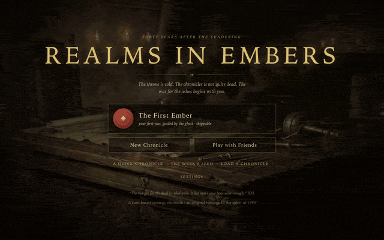
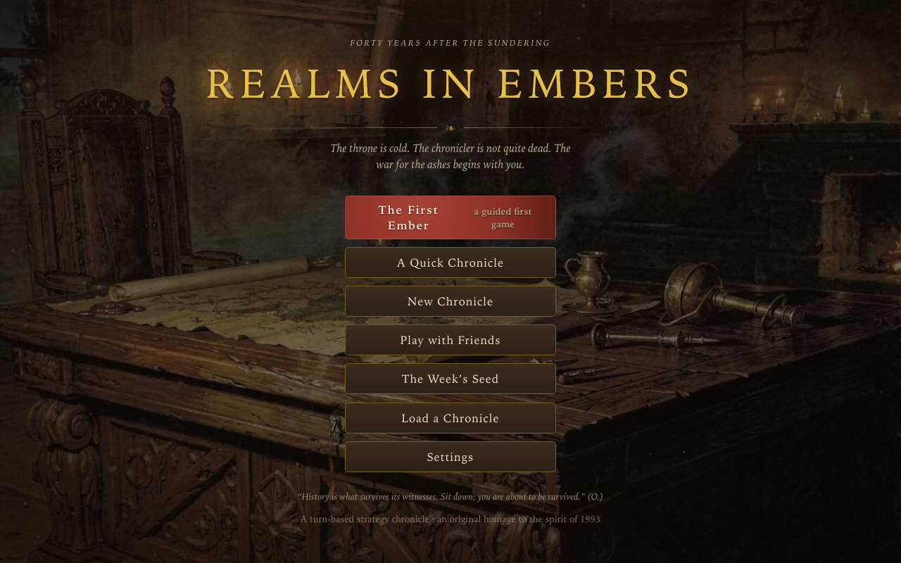
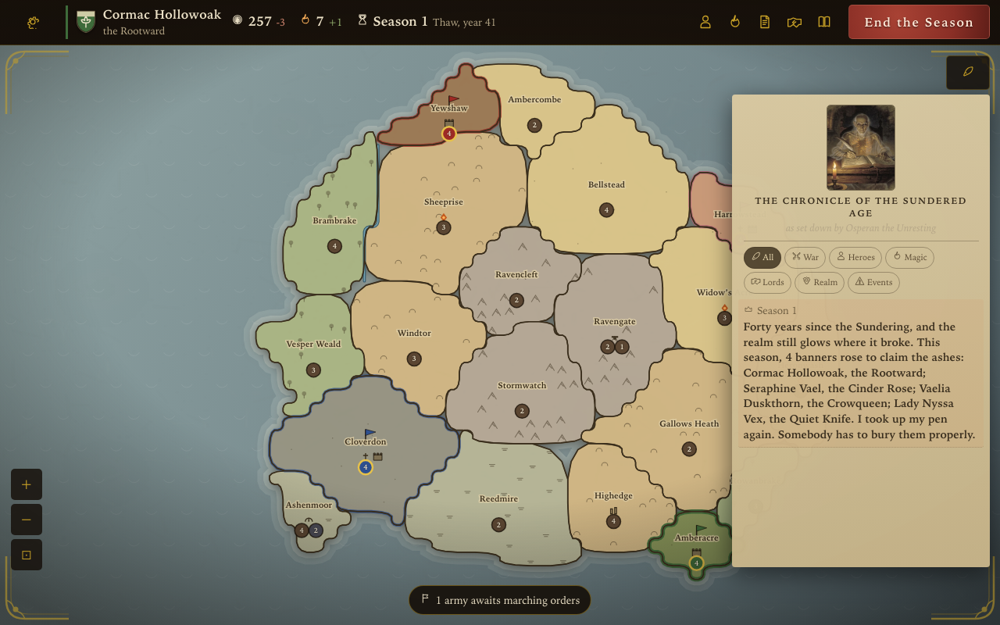
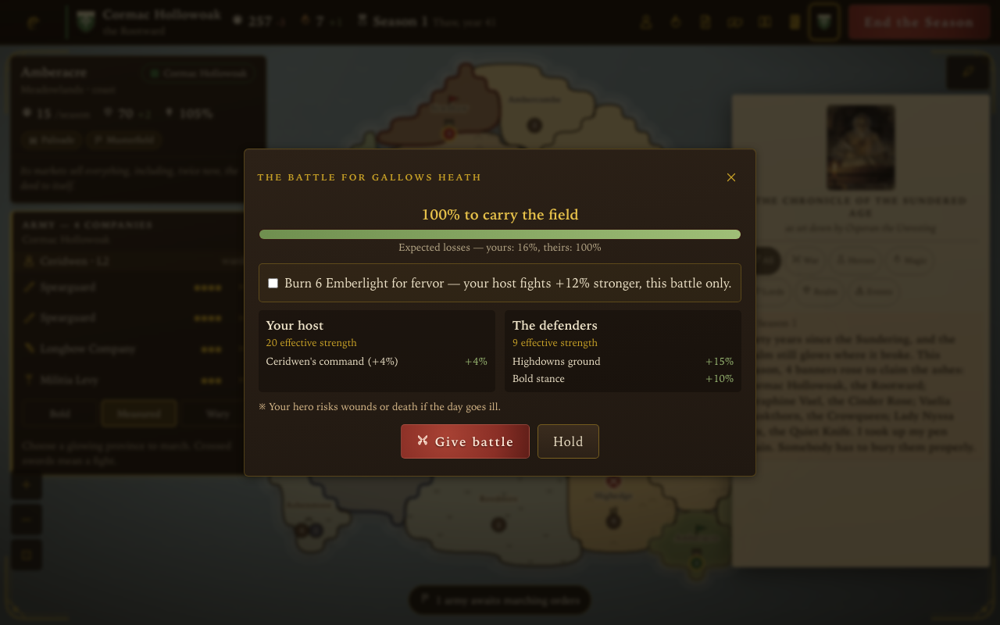
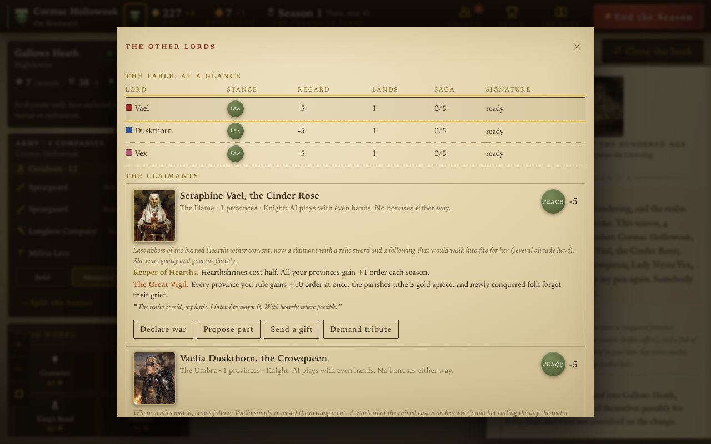

<p align="center"></p>

<h1 align="center">Realms in Embers</h1>

<p align="center"><b>A turn-based fantasy strategy chronicle for the browser.</b></p>

<p align="center">Twelve lords · one cold throne · a narrator who refuses to stay dead</p>

<p align="center">
<a href=".github/workflows/ci.yml"></a>
<a href="LICENSE"></a>
<a href="LICENSE-CONTENT"></a>

</p>

<p align="center"><a href="#play">Play</a> · <a href="#the-game-in-one-paragraph">What is this</a> · <a href="#three-ways-to-war">Multiplayer</a> · <a href="#run-it-yourself">Run it</a> · <a href="#the-making-of">The making of</a> · <a href="CREDITS.md">Credits</a></p>

> A side project that got gloriously out of hand: a love letter to the *spirit* of SSI's 1993 classic Fantasy Empires — original fiction, original rules, zero runtime dependencies, and a dead chronicler who still meets his deadlines.



## Play

**[rie.gg](https://rie.gg)** — free, no account, nothing to install. ([realmsinembers.com](https://realmsinembers.com) gets you there too.) Works on phones, installs from the browser as an app, and the whole game keeps working offline after the first load. A full campaign fills an evening; a short chronicle fits a lunch break.

## The game in one paragraph

Pick a lord in the painted gallery (twelve, in three creeds, each with a real temperament the AI genuinely plays, and each with two abilities: a legacy that shapes them and a signature order that is theirs alone). Expand across a procedurally forged realm — every seed is shareable and reforges identically. Raise works and companies, mind your order (every number itemizes its causes on hover), send heroes on quests, learn workings of Emberlight, read your rivals' grudges in plain lines, and reach one of five endings: conquest, dominion, a golden age, the Legend of the rekindled throne — or the judgment of the Chronicle when the page runs out. Every game ends. The saga export hands you the whole war as a story when it's over.

## What a season feels like

<table>
<tr>
<td width="50%"></td>
<td width="50%"></td>
</tr>
<tr>
<td></td>
<td></td>
</tr>
</table>

- **Every number explains itself.** Income, order, attitude, victory standing — hover anything and Osperan itemizes where it comes from. If a number in this realm cannot explain itself, he has failed, and he does not intend to fail twice in one age.
- **Battles are honest.** Before any blood, a Monte-Carlo preview shows both sides' full modifiers in plain words — run on a forked RNG, so checking your odds can never change your fate. Combine banners from several provinces for one assault, or burn raw Emberlight for fervor. All previewed.
- **Rivals scheme in the open.** Attitude is an itemized ledger of remembered deeds. Alliances defend and share maps. Lords call allies into their wars with gold. Grow past forty percent of the realm and the rest of the table forms a league about it.
- **The narrator is the game.** Tutorial, chronicle, and endgame export are one system — Osperan's book. Big moments stop the room; small ones get a dry line in the margin. He is voiced, painted, and behind schedule.
- **The rules live in the book.** The Codex (press c) is Osperan's complete handbook — every number rendered from the engine's own constants, so the book cannot drift from the battlefield.
- **It ends.** Five distinct endings, all reachable, all raced in public. From season 38 the Chronicle wearies and the dominion bar erodes — late games finish in thrones, not timeouts.

## Three ways to war

- **Online** — "Online War" on the title screen. One invite link seats up to six; turn clocks (relaxed / standard / blitz, bank + increment) keep a full war inside two hours. **The relay is blind:** every action is end-to-end encrypted with a key that lives only in the invite link's URL fragment. The server stores ciphertext and ordinals; it cannot read a single move. Reconnecting replays the encrypted log through the deterministic engine — you rejoin exactly where the war stands. Self-host the relay with `node server/relay.mjs`, the Dockerfile in `server/`, or the included Cloudflare Worker.
- **Hotseat** — several mortals, one device; the map hides between turns.
- **Courier** — war by letters: export the chronicle file after your turns, the other side loads it and plays on. A stalled online session degrades gracefully into this.

## Run it yourself

```bash
npm install
npm run dev        # http://localhost:5173 — desktop and phone
```

```bash
npm test           # 56 tests: engine, signatures, replay determinism, the rules-version canary
npm run sim        # headless AI-vs-AI sweep with invariants checked every round
npm run build      # typecheck + production build (~146 KB gzipped, zero runtime deps)
```

## The making of

Some of the machinery is half the fun:

- **A deterministic core.** One seeded RNG lives inside a single serializable state object; every mutation — human and AI — is an action in a log. Seed + log replays byte-identically, a frozen fixture guards the rules version, and that determinism is also the multiplayer netcode.
- **A model playtester.** `scripts/model-playtest.mjs` seats a language model at the table through the real engine. On its first outing it found a real exploit (the counting-house was lending gold it could never collect before the game ended) and filed a structured complaint about our error messages. Both fixed.
- **The Illustrated Edition, one command.** Ninety-one painted plates in a late-80s game-manual style, generated against a single approved style anchor so the whole set reads as one painter's hand — and every slot is generated three to five times, reviewed against its brief, and only the best candidate ships (`scripts/gen-art.mjs --candidates` + `scripts/pick-art.mjs`). The procedural heraldry remains as the eternal fallback.
- **A ghost with a voice.** The chronicler's ceremonies are spoken (`scripts/gen-audio.mjs`); the synth engine still covers every sound offline.

Deeper reading: [`DECISIONS.md`](DECISIONS.md) (why things are the way they are), [`docs/ART.md`](docs/ART.md) (the whole art pipeline), [`CHANGELOG.md`](CHANGELOG.md), and [`STATE.md`](STATE.md) (the honest build log).

## Credits & licenses

**Free forever, open source, no accounts, no tracking.** Code: [AGPL-3.0](LICENSE) — nobody can take this game closed-source or sell it out from under its players. Fiction & art: [CC BY-SA 4.0](LICENSE-CONTENT). Music: Scott Buckley, CC-BY 4.0. Full attribution in [`CREDITS.md`](CREDITS.md).

*Not affiliated with, endorsed by, or containing material from SSI's successors, Ubisoft, Wizards of the Coast, or Hasbro. All fiction, names, and systems are original.*

---

<p align="center"><i>The fire is yours now. Mind it. — O.</i></p>
